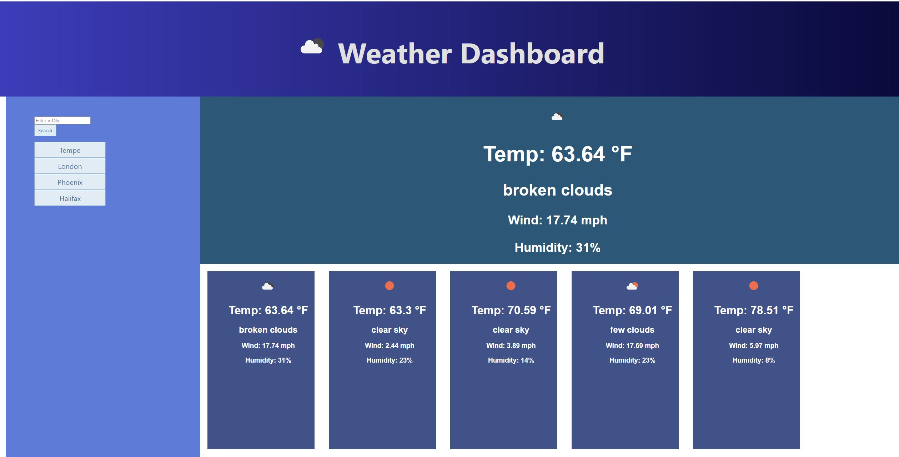

# weatherapp

Link: https://scrysis.github.io/weatherapp/

Hello and welcome to my weather app!

Just type in the city that you want to see the weather for, and it will appear for the next five days!

The top largest panel is today's weather.  The smaller panels underneath echo the current weather, plus the
next four days.

The app automatically saves your searches to local storage so that you can revisit them again and again.
Just click on the button and it will load your selection and search it for you!